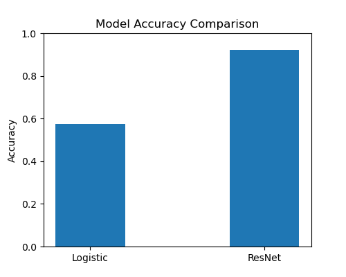
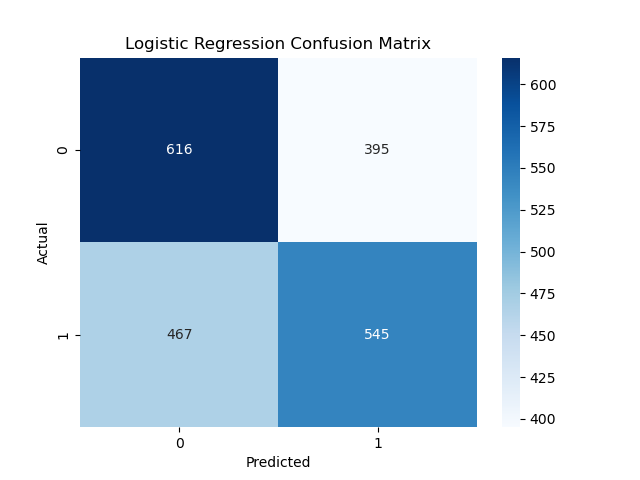
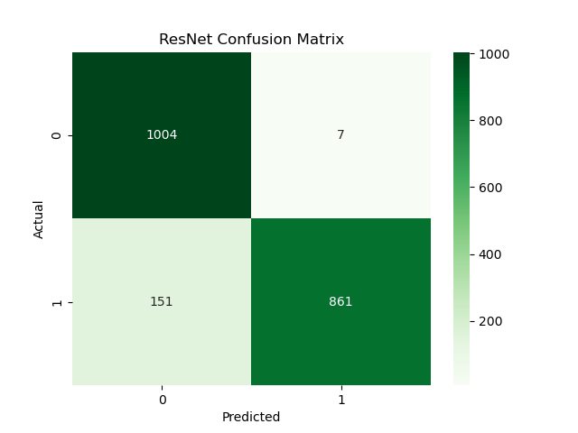

# Comparison of Logistic Regression and ResNet for Image Classification

## 📌 Project Overview
This project presents a comparison between a traditional machine learning model (Logistic Regression) and a deep learning model (ResNet) for a binary image classification task (cats vs dogs).

The objective is to evaluate performance differences and demonstrate how deep neural networks outperform classical models in handling complex visual data. ResNet, a deep convolutional neural network, is known for its residual connections that improve training of deep architectures and significantly enhance performance ([数据鲸](https://datawhalechina.github.io/thorough-pytorch/%E7%AC%AC%E5%8D%81%E7%AB%A0/ResNet%E6%BA%90%E7%A0%81%E8%A7%A3%E8%AF%BB.html?utm_source=chatgpt.com)).

---

## ⚙️ Methods

### Logistic Regression
- A classical statistical model for binary classification
- Relies on manually extracted or simplified features
- Limited ability to capture complex image patterns

### ResNet (Residual Neural Network)
- A deep convolutional neural network
- Uses residual connections to mitigate vanishing gradients
- Capable of learning hierarchical and complex image features
- Widely used in modern computer vision tasks

---

## 📊 Results

### Model Accuracy Comparison


### Logistic Regression Confusion Matrix


### ResNet Confusion Matrix


---

## 🔍 Analysis

- ResNet significantly outperforms Logistic Regression in classification accuracy.
- Logistic Regression struggles with high-dimensional image data due to limited feature representation.
- The confusion matrices show that ResNet achieves:
  - Higher true positive rates  
  - Lower misclassification rates  
- This confirms that deep learning models are more suitable for image classification tasks.

---

## 📁 Project Structure

```
.
├── data/
├── models/
├── results/
│   ├── model_accuracy_comparison.png
│   ├── lr_confusion_matrix.png
│   └── resnet_confusion_matrix.png
├── utils/
├── logistic.py
├── resnet.py
├── train.py
├── LICENSE
```

---

## ▶️ How to Run

### 1. Install dependencies
```bash
pip install -r requirements.txt
```

### 2. Train and evaluate models
```bash
python train.py
```

---

## 🧾 Requirements

- Python 3.x  
- PyTorch  
- NumPy  
- Matplotlib  
- scikit-learn  

---

## 📎 Code Availability

The full implementation is available on GitHub:  
https://github.com/ZhiyuanYang0105/Comparison-of-Logistic-Regression-and-ResNet-for-Image-Classification

---

## 📚 References

- Cox, D. R. (1958). The regression analysis of binary sequences. *Journal of the Royal Statistical Society: Series B (Methodological)*.  
- LeCun, Y., Bottou, L., Bengio, Y., & Haffner, P. (1998). Gradient-based learning applied to document recognition. *Proceedings of the IEEE*.  

---

## 📌 Notes

- The dataset is not included due to size limitations.
- Please organize your dataset under the `data/` directory.
- This project is intended for educational and research purposes.

---

## 👤 Author

Zhiyuan Yang  
GitHub: [https://github.com/ZhiyuanYang0105](https://github.com/ZhiyuanYang0105/Comparison-of-Logistic-Regression-and-ResNet-for-Image-Classification)
